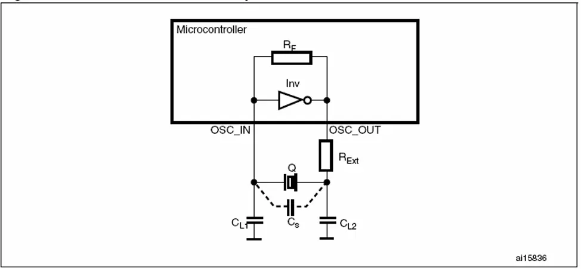
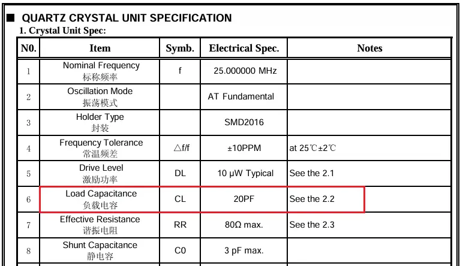

记录晶体的驱动电路以及外部负载电容的计算方法。

<!--more-->

晶体驱动电路如下图：

其中
* Rext：外部限流电阻。
* CL1和CL2：两个外部负载电容。
* Cs：由于PCB布线及连接等寄生效应引起的等效杂散电容，一般在2~7pF之间。

## 负载电容CL
负载电容CL值由晶振制造商给出。以星通时频[SX3B25.000F2010F30](https://item.szlcsc.com/3151500.html?fromZone=s_s__%252225M%2520%25E6%2597%25A0%25E6%25BA%2590%25E6%2599%25B6%25E6%258C%25AF%2522&spm=sc.gb.xh30.zy.n&lcsc_vid=EVJaBVwCQVNfXlwDT1RfUVwDEQRWX1BVT1NcBVQFRlgxVlNSRVJXV1VXRFZeUDsOAxUeFF5JWBYZEEoVDQ0NFAdIFA4DSA%3D%3D)晶振为例。

上图是晶振的数据手册中关于晶振特性的介绍。可以看到CL=20pF。

CL的表达式如下：

Cs取值为5pF。

则 Cl1=Cl2=30pF。